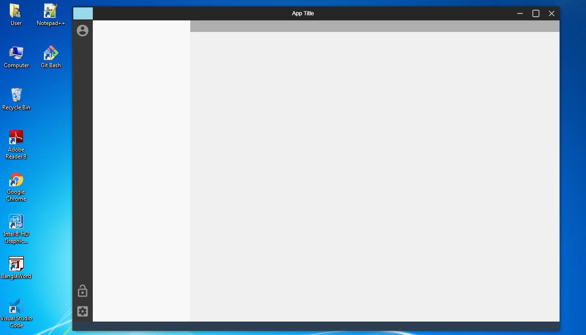

# Groot
Basic Electron buliding block to start any electron project :grimacing:



### Installation  
Kindly install [node.js](https://nodejs.org/en/download/) before running this app and set the 
[path Variable](https://stackoverflow.com/questions/27864040/fixing-npm-path-in-windows-8-and-10/27864331) Accordingly.

* Clone this repository or download it in local directory.
* open cmd, point to  project directory and  run **npm install** 
  ```bash
  $ npm install 
  ```
* once installation is finished, run **npm start** to launch the application.
  ```bash
  $ npm start
  ```

  ### Features
  * Multi Window
  * Single Instance
  * Crash Handling
  * CSS Grid 
  
